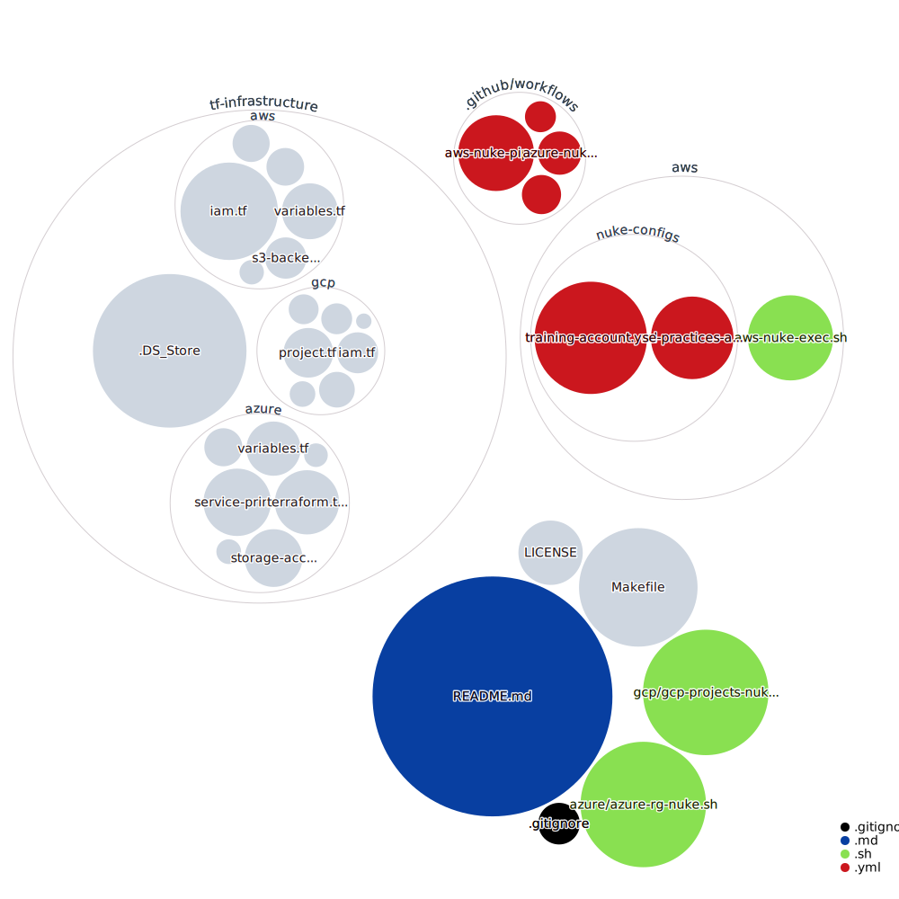

# Table of Content

- [Pipelines Status](#pipelines-status)
- [Introduction](#introduction)
- [AWS](#aws)
- [Azure](#azure)
- [Terraform Infrastructure](#terraform-infrastructure)

# Pipelines Status

The pipelines are scheduled to run `every Friday at 17:00` in Github Actions.

Although the real execution may vary based on availability of the executors.

# Introduction

While in the process of learning and exploring the realms of Public Cloud (AWS, Azure, and GCP), we often find ourselves provisioning numerous resources that might be spread across various accounts and regions.

However, there's a catch – if we happen to overlook the deprovisioning or destruction of these resources, they end up incurring charges to our account.

To prevent a dent in our financial, we've adopted AWS Nuke and Cloud Provider based CLI's within our script that helps obliterate these lingering and unnecessary resources.

By doing so, we're not only saving a few bucks 💰 but also securing the resources we really need.

This repository takes charge of eradicating transient infrastructure that has been set up in AWS, Azure, and GCP Cloud Accounts. So, let the cleaning begin! 🚀🔥

Available Make Commands:

The codebase can be visualized as below:



# AWS

We are using [AWS Nuke](https://github.com/rebuy-de/aws-nuke) for nuking the unwanted resources in the AWS Account (at the moment only aws-training & se-practices account).

<details>
  <summary>Click here to see the details of AWS Nuke Implementation</summary>

### Table of Content

---

- [Considerations](#considerations)
- [Known Issues](#known-issues)
- [Prerequisite](#prerequisite)
- [Login to AWS Account](#login-to-aws-account)
- [AWS Nuke Execution](#aws-nuke-execution)
  - [On SE Practices Account](#on-se-practices-account)
    - [AWS Nuke Scan SE Practices](#aws-nuke-scan-se-practices)
    - [AWS Nuke Destroy SE Practices](#aws-nuke-destroy-se-practices)
  - [On Training Account](#on-training-account)
    - [AWS Nuke Scan Training](#aws-nuke-scan-training)
    - [AWS Nuke Destroy Training](#aws-nuke-destroy-training)
- [GitHub Actions](#github-actions)
- [To Do List](#to-do-list)

### Considerations

At the moment we are using two different yml configuration files per account for the below reasons, which may change in future:

- Separate config file to make it more readable
- Our current AWS IAM Credentials are configured to access resources only in the same account.

Below are the configuration files:
1. [training-account.yml](./training-account.yml) : 1234567890 - All the US regions & Global.
2. [se-practices-account.yml](./se-practices-account.yml) : 9087654321 - All regions & Global.

By default, not all AWS Regions are enabled hence when AWS-Nuke attempts to nuke the resources using the credentials we provided we get "401: AWS was not able to validate the provided access credentials" error.

Hence we have commented AWS regions that were not enabled in AWS Accounts as of 10th July 2021.

Reference links:
- [401 in non enabled Accounts](https://aws.amazon.com/premiumsupport/knowledge-center/iam-validate-access-credentials/)
- [Regional STS](https://aws.amazon.com/about-aws/whats-new/2019/04/aws-security-token-service-sts-now-supports-enabling-the-global-sts-endpoint-to-issue-session-tokens-compatible-with-all-aws-regions/)

Once logged in, to see enabled AWS Regions for the given account execute below:

```bash
aws ec2 describe-regions | jq -r '.Regions[].RegionName'
```

For further explanation you can reach out to:
- [Abhishek](https://github.com/abhisheksr01/)

### Known Issues

For the "Training" AWS account we have disabled execution on `eu-west-1` region as the Github Action fails to nuke any resources in the pipeline.

The above issue occured due to the `Out of Memory` for the `eu-west-1` region.
Hence until we are able to resolve the OOM issue we'll have to manually execute AWS Nuke by un commenting `eu-west-1` in the [training-account.yml](./nuke-configs/training-account.yml) and using below make command:

```ssh
make aws-nuke-destroy account="training"
```

One done kindly add the manual execution logs to the [manual-execution-logs](./manual-execution-logs) directory in the root of the repo for the tracing perspective.

## Prerequisite

- You should have AWS CLI configured.
- Terraform 1.0.1 or higher if you want to run terraform
- nice to have `make`, `jq` and `wget` installed
### Macbook
From the root of this repository execute the below command:
```bash
make aws-nuke-install
```
### Others
[Click here](https://github.com/rebuy-de/aws-nuke#install) to see AWS Nuke installation options.

Once installed rename the binary to "aws-nuke" and add it to the $PATH location.

## Login to AWS Account

Log in to the respective AWS Account against which you would like to perform AWS Nuke operations.

At the moment this repository has the configuration for `training` and `se-practices` accounts.

Note: You must have Admin Rights to perform the aws nuke operations.


## AWS Nuke Execution
### On SE Practices Account
#### AWS Nuke Scan SE Practices
The below command runs a scan against the configuration file to see what resources can be removed or lists nukeable resources.

The filtered resources will be tagged as `filtered by config` & the ones which can be removed as `would remove`.

You can see the resources filtered in the [se-practices-account.yml](./se-practices-account.yml) under the preset section.
```bash
make aws-nuke-scan account=se-practices
```
or directly:
```bash
cd nuke-configs && aws-nuke -c se-practices-account.yml --force
```
Here the `--force` flag skips the manual confirmation.

The above is identical to `terraform plan` and will not remove any resources.
#### AWS Nuke Destroy SE Practices
⚠️⚠️⚠️⚠️⚠️⚠️⚠️⚠️⚠️⚠️⚠️⚠️⚠️⚠️⚠️⚠️ WARNING ⚠️⚠️⚠️⚠️⚠️⚠️⚠️⚠️⚠️⚠️⚠️⚠️⚠️⚠️⚠️⚠️

<b>Do not run AWS Nuke against the production account.</br>
Make sure you have executed the scan command and thoroughly verified the resources to be nuked.</br>
In case of any confusion kindly DO NOT PROCEED with destroy.</b>

⚠️⚠️⚠️⚠️⚠️⚠️⚠️⚠️⚠️⚠️⚠️⚠️⚠️⚠️⚠️⚠️ WARNING ⚠️⚠️⚠️⚠️⚠️⚠️⚠️⚠️⚠️⚠️⚠️⚠️⚠️⚠️⚠️⚠️

<b>It's highly recommended that you use the [GitHub Actions pipeline](#github-actions) to nuke the resources as it'll be consistent and execution logs will be stored in the pipeline</b>

The below command runs against the configuration file to nuke/destroy resources.

The nuked resources will be tagged as `removed`.
```bash
make aws-nuke-destroy account=se-practices
```
or directly:
```bash
aws-nuke -c se-practices-account.yml --no-dry-run
```
Here the `--no-dry-run` flag allows the aws-nuke to nuke the resources and as a precautionary measure we do not add the `--force flag`.

The above is identical to `terraform apply` and will nuke the resource.
### On Training Account
#### AWS Nuke Scan Training
Make sure you are logged in to the Training account.

The below command runs a scan against the configuration file to see what resources can be removed or lists nukeable resources.

You can see the resources filtered in the [training-account.yml](./training-account.yml) under the preset section.
```bash
make aws-nuke-scan account=training
```
or directly:
```bash
cd nuke-configs && aws-nuke -c se-practices-account.yml --force
```
Here the `--force` flag skips the manual confirmation.

The above is identical to `terraform plan` and will not remove any resources.

Note: eu-west-1 is tricky as lots of bucket data is stored in this region.
#### AWS Nuke Destroy Training
⚠️⚠️⚠️⚠️⚠️⚠️⚠️⚠️⚠️⚠️⚠️⚠️⚠️⚠️⚠️⚠️ WARNING ⚠️⚠️⚠️⚠️⚠️⚠️⚠️⚠️⚠️⚠️⚠️⚠️⚠️⚠️⚠️⚠️

<b>Do not run AWS Nuke against the production account.</br>
Make sure you have executed the scan command and thoroughly verified the resources to be nuked.</br>
In case of any confusion kindly DO NOT PROCEED with destroy.</b>

⚠️⚠️⚠️⚠️⚠️⚠️⚠️⚠️⚠️⚠️⚠️⚠️⚠️⚠️⚠️⚠️ WARNING ⚠️⚠️⚠️⚠️⚠️⚠️⚠️⚠️⚠️⚠️⚠️⚠️⚠️⚠️⚠️⚠️

<b>It's highly recommended that you use the [GitHub Actions pipeline](#github-actions) to nuke the resources as it'll be consistent and execution logs will be stored in the pipeline</b>

The below command runs against the configuration file to nuke/destroy resources.

The nuked resources will be tagged as `removed`.
```bash
make aws-nuke-destroy account=training
```
or directly:
```bash
aws-nuke -c training-account.yml --no-dry-run
```
Here the `--no-dry-run` flag allows the aws-nuke to nuke the resources and as a precautionary measure we have not added the `--force` flag.

The above is identical to `terraform apply` and will nuke the resource.

## GitHub Actions
We have scheduled aws-nuke execution at <b>17:00 every Friday</b> in GitHub Actions pipeline or can be manually triggered.

The jobs uses IAM User created through Terraform and can assume Admin roles in respective accounts.

You can see the pipeline configuration [here](./.github/workflows/aws-nuke-pipeline.yml)

The pipeline has two independent jobs `se-practices` and `training` within the workflow of `nuke-aws-accounts`.


- se-practices: This job destroys resources in all regions and global in the se-practices account.
- training: This job destroys resources in all US regions and global in the training account.

The credentials required for GITHUB Actions are stored in the repository secrets & IAM user credentials as backup are stored in 1Password.

After the execution, the respective jobs uploads logs files as artifacts and can be downloaded from the GitHub Actions UI.

## To Do List

This is the list of things (Non Prioritized) which we need to do to make aws-nuke work better.

- Refactor Terraform code to reduce boiler plate & follow DRY
- IAM Assumed roles, assert the current approach of granting access. Implement if their is a better one!
- Terraform the manual role creation in se-practices account.
- Add Preset/filters for the resources which needs to stay and then after everyone's confirmation nuke training account.
- Nuke training for all regions (eu-west-1 is tricky as lots of bucket data is stored in this region)
- Check if we have other AWS Accounts which can be nuked.
- Check the best practice for running AWS-NUKE & assert the current implementation. ex single config vs multiple.
- Use python panda for better visualization of the aws-nuke stdouts.
- Execute AWS-Nuke <b>plan/scan</b> against the production account. Just to see what orphaned resources we have.DO NOT RUN DESTROY COMMAND IN PROD ACCOUNT.

</details>

# Azure

We are using `az cli` command based script to delete unwanted Resource Groups from Azure.

You can check:
- The script code in [./azure](./azure) directory.
- Terraform Code in [./tf-infrastructure/azure](./tf-infrastructure/azure/) directory.
- Pipeline Configuration in [.github/workflows/azure-nuke-pipeline.yml](.github/workflows/azure-nuke-pipeline.yml)

We have implemented OIDC-based authentication to enhance security when providing access to Azure Resources through our Github Actions Pipeline. 

<details>
  <summary>Click here to see detailed Implementation:</summary>

#### Setting Up OIDC Federated credentials for Github Actions.

The steps outlined below were followed to configure the OIDC setup.

- Create a Service Principal with OIDC Federated Credentials

Review the Terraform code located at [./tf-infrastructure/azure/service-principal.tf](./tf-infrastructure/azure/service-principal.tf) for insights into establishing the Service Principal Name (SPN) using OIDC Federated credentials through Terraform.

  Note: You may want to change `subject` attribute based on your requirements.

- Update the Github Actions pipeline YAML to allow OIDC by adding below permissions:
  ```yaml
  permissions:
    id-token: write
    contents: read
  ```
  
- Add below Azure Credentials in Github Secrets of the repository
  - Service Principal CLIENT_ID as `AZ_CLIENT_ID`
  - TENANT_ID as `AZ_TENANT_ID`
  - SUBSCRIPTION_ID as `AZ_SUBSCRIPTION_ID`

- Update Github Actions Pipeline YAML
  
  Add them as below:
  ```yaml
  - uses: azure/login@v1
    with:
      client-id: ${{ secrets.AZ_CLIENT_ID }}
      tenant-id: ${{ secrets.AZ_TENANT_ID }}
      subscription-id: ${{ secrets.AZ_SUBSCRIPTION_ID }}

  ```
  The official documentation explaining the process can be found [here](https://learn.microsoft.com/en-us/azure/active-directory/workload-identities/workload-identity-federation-create-trust?pivots=identity-wif-apps-methods-azp#github-actions).

</details>

# Terraform Infrastructure
We are using Terraform for provisioning infrastructure required for Nuking the resources in AWS, GCP & Azure Cloud Accounts.

<details>
<summary>Click here to learn about AWS Specific Implementation</summary>

You must have Terraform 1.0.1 version installed and logged in to the `AWS Training Account` using google-auth.

The current terraform code creates a bucket in the training account to store the TF state and IAM Group, User, attaches Group policies and user to user group respectively.

Currently, we have manually created `aws-nuke-access-delegator-admin-role` in the `se-practices` which we should add in the TF.

Because it's the 🐔 and the 🥚 problem.
</details>

### Authentication

Use respective cloud provider's cli authentication mechanism before running any of the commands.

Once done you must export below variable.

```
export CLOUD_PROVIDER=[CLOUD_PROVIDER_NAME]
```

Possible values for CLOUD_PROVIDER_NAME are `aws`, `gcp` and `azure` respectively.

### Terraform Init

From root of the directory execute the below command:
```bash
make tf-init
```
or directly
```bash
cd tf-infrastructure/$CLOUD_PROVIDER && terraform init -backend-config=./backend-config.hcl
```

### Terraform Quality
From root of the directory execute the below command:

Runs fmt and validate against the TF code.
```bash
make tf-quality
```
or from tf-infrastructure dir
```bash
terraform fmt --diff --check --recursive && terraform validate
```

### Terraform Plan
```bash
make tf-plan
```
or from tf-infrastructure dir
```bash
terraform plan
```
### Terraform Apply
If the plan was as expected then execute the below command:
```bash
make tf-apply
```
or from tf-infrastructure dir
```bash
terraform apply
```